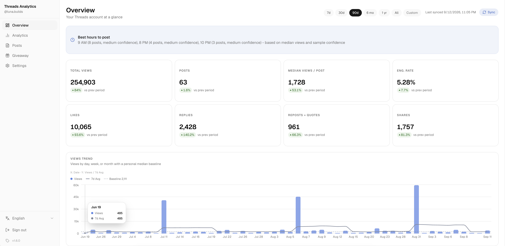

<p align="center">
  
</p>
<h1 align="center">Threads Analytics</h1>
<p align="center">
  セルフホスト型の Threads アナリティクスダッシュボード。アクセストークンを接続すると、詳細なチャートと指標で投稿パフォーマンスを分析できます。
</p>
<p align="center">
  <a href="https://github.com/ridemountainpig/threads-analytics/stargazers"></a>
  <a href="./LICENSE"></a>
  <a href="https://github.com/ridemountainpig/threads-analytics/pkgs/container/threads-analytics"></a>
</p>
<p align="center">
  <a href="./README-zh.md">繁體中文</a> · <a href="./README.md">English</a> · <a href="./README-ja.md">日本語</a>
</p>

<p align="center">
  
</p>

---

## 目次

- [機能](#機能)
- [クイックスタート](#クイックスタート)
- [Threads アクセストークンの取得](#threads-アクセストークンの取得)
- [MCP サーバー](#mcp-サーバー)
- [デプロイ](#デプロイ)
  - [Docker](#docker)
  - [Vercel](#vercel)
  - [自動同期](#自動同期)
  - [既存デプロイの更新](#既存デプロイの更新)
- [開発セットアップ](#開発セットアップ)
- [アナリティクスリファレンス](#アナリティクスリファレンス)
- [ライセンス](#ライセンス)

---

## 機能

- **概要** — 統計カード（ビュー、いいね、リプライ、リポスト、引用、シェア、エンゲージメント率）と前期比、ビュー推移チャート（日／週／月）、最適投稿時間の推奨、バイラル投稿
- **アナリティクス** — **パフォーマンス**、**コンテンツ**、**オーディエンス**の 3 タブにまたがる 25 種類以上のチャート
- **投稿** — 検索・フィルタ可能なリストと投稿ごとのアナリティクスパネル
- **MCP サーバー** — Claude などの AI エージェントが OAuth 保護されたエンドポイント経由でアナリティクスを照会可能
- 複数アカウント対応、アカウント切り替え可能
- 設定可能な間隔での自動同期
- アクセストークンの自動更新 — 一度接続すれば、60 日ごとに手動で貼り直す必要はありません
- パスワード保護（単一の `APP_PASSWORD` 環境変数）
- English / 繁體中文 / 日本語 UI

---

## クイックスタート

最速でインスタンスを立ち上げる方法はワンクリックデプロイです — どちらのテンプレートも PostgreSQL データベースのプロビジョニングと必要な環境変数の設定を自動で行います：

| プラットフォーム | デプロイ                                                                                                                                                                      |
| ---------------- | ----------------------------------------------------------------------------------------------------------------------------------------------------------------------------- |
| Railway          | [](https://railway.com/deploy/zibjsX?referralCode=vPBCb4&utm_medium=integration&utm_source=template&utm_campaign=generic) |
| Zeabur           | [](https://zeabur.com/templates/XLGQAD)                                                                                     |

AI コーディングエージェント（Claude Code、Codex、Cursor など）に任せることもできます。各エージェントデプロイガイドには、エージェントに貼り付けるだけでデータベースの作成、デプロイ、URL の報告まで自動で行うプロンプトが用意されています：[Railway](https://threads-analytics.app/ja/deploy/railway-agent) · [Zeabur](https://threads-analytics.app/ja/deploy/zeabur-agent) · [Vercel](https://threads-analytics.app/ja/deploy/vercel-agent)

すでにサーバーがある場合は、ビルド済みイメージを直接実行できます（詳細は [Docker](#docker)）：

```bash
docker run -p 3000:3000 --env-file .env.local ghcr.io/ridemountainpig/threads-analytics:latest
```

アプリが起動したら `APP_PASSWORD` でサインインし、Threads アカウントを接続します — 次のセクションを参照してください。ソースから実行する場合は[開発セットアップ](#開発セットアップ)へ。

---

## Threads アクセストークンの取得

1. [developers.facebook.com](https://developers.facebook.com) で **Access the Threads API** use case を含むアプリを作成
2. **アクセストークン**を生成
3. ダッシュボードで **設定 → Threads アカウントを追加 → トークンを貼り付け**

スクリーンショット付きの詳しい手順は [Threads アクセストークンの生成方法](./public/token-generate-step/README-ja.md) を参照してください。

トークンの有効期限は 60 日間で、アプリが自動的に更新します：

- 同期のたびにトークンを確認し、残り 30 日を切ると自動的に 60 日間延長されます（Threads API は発行から 24 時間以上経過したトークンのみ更新可能）。
- 設定のアカウントカードにトークンの有効期限と最後の自動更新日時が表示されます。
- それでもトークンが期限切れになった場合（アプリが長期間停止して同期が走らなかったなど）はダッシュボードに警告が表示されます。新しいトークンを生成し、アカウントカードの**トークンを更新**ボタンから貼り付けてください。同期済みのデータはそのまま保持されます。

---

## MCP サーバー

ダッシュボードにはリモート [MCP](https://modelcontextprotocol.io) サーバー（`/api/mcp`、Streamable HTTP）が組み込まれており、Claude などの AI エージェントが同期済みの Threads データ——投稿、集計アナリティクス、フォロワー履歴——を直接照会し、質問への回答やレポート作成に利用できます。すべて**読み取り専用**です。

### エージェントの接続

認証は OAuth 2.1（PKCE + Dynamic Client Registration）で、API キーのコピーは不要です。初回接続時にクライアントが自動登録され、ブラウザでダッシュボードのログイン（`APP_PASSWORD`）が開き、同意画面でアクセスを承認します。

**Claude Code**

```bash
claude mcp add --transport http threads-analytics https://your-deployment.example.com/api/mcp
```

その後、Claude Code 内で `/mcp` を実行して OAuth サインインを完了します。

**Claude（Web / デスクトップ）** — 設定 → Connectors → **Add custom connector** で `https://your-deployment.example.com/api/mcp` を貼り付けます。

接続済みクライアントは**設定 → 接続済みエージェント**に表示され、いつでも取り消せます。

### ツール

| ツール                 | 機能                                                                                                                             |
| ---------------------- | -------------------------------------------------------------------------------------------------------------------------------- |
| `get_account_overview` | ユーザー名、同期状態、投稿数、データ期間、フォロワー成長サマリー——最初に呼ぶことを推奨                                           |
| `list_posts`           | 指標付き投稿リスト。期間指定、並び替え（日付／ビュー／いいね／エンゲージメント率）、メディアタイプフィルタ、全文検索、ページング |
| `get_post`             | 単一投稿の全詳細（全文を含む）                                                                                                   |
| `get_analytics`        | 期間内の 31 種類の集計アナリティクスセクション（最適投稿時間、キーワード分析、ビュー分布、投稿ストリークなど）。必要な分だけ取得 |
| `get_follower_history` | 日次フォロワースナップショットと成長サマリー。オプションで最新のオーディエンス構成                                               |
| `compare_periods`      | 2 期間のコア指標を絶対値・パーセント変化付きで比較。比較期間は直前の同じ長さの期間がデフォルト                                   |

### プロンプト

サーバーには既製のプロンプトも登録されており、いずれもオプションの `period` 引数（`30d`、`90d`、日付範囲など）を受け取ります：

| プロンプト             | 生成内容                                                         |
| ---------------------- | ---------------------------------------------------------------- |
| `performance-review`   | トレンド、ベスト／ワースト投稿、改善アクションを含む成果レポート |
| `content-strategy`     | 有効なフォーマット・長さ・トピックと推奨コンテンツミックス       |
| `posting-schedule`     | オーディエンスの反応時間に基づく具体的な週間投稿スケジュール     |
| `viral-post-breakdown` | バイラル投稿の深掘りと再現可能なパターンの抽出                   |
| `audience-insights`    | フォロワー成長と構成、コンテンツ・タイミングへの示唆             |
| `topic-analysis`       | 成果を生むトピックと文章パターン、新しい投稿アイデア             |

---

## デプロイ

### Docker

GitHub Container Registry にビルド済みのマルチアーキテクチャ（amd64/arm64）イメージが公開されています。[環境変数](#2-環境変数の設定)を設定後、次を実行：

```bash
docker run -p 3000:3000 --env-file .env.local ghcr.io/ridemountainpig/threads-analytics:latest
```

ソースから自分でビルドすることもできます：

```bash
docker build -t threads-analytics .
docker run -p 3000:3000 --env-file .env.local threads-analytics
```

Docker イメージは起動時に `prisma migrate deploy` を自動実行します。

### Vercel

リポジトリを Vercel にインポートし、[環境変数](#2-環境変数の設定)を設定します。マイグレーションは `vercel-build` スクリプト（`prisma migrate deploy && next build`）としてビルド時に実行されます。Vercel はこのスクリプトがあれば `build` より優先します。

Vercel は長時間実行プロセスをサポートしていないため、内蔵の同期スケジューラは動作しません。代わりに [Vercel Cron Jobs](https://vercel.com/docs/cron-jobs) を使って `/api/cron/sync` をスケジュール実行してください：

1. プロジェクトルートに `vercel.json` を追加：

   ```json
   {
     "crons": [
       {
         "path": "/api/cron/sync",
         "schedule": "0 * * * *"
       }
     ]
   }
   ```

   `schedule` は Settings で設定した同期間隔に合わせます（例: 毎時 `0 * * * *`、30 分ごと `*/30 * * * *`）。Vercel の無料プランでは cron の頻度に制限があるので注意してください。

2. Vercel ダッシュボードの **Settings → Environment Variables** で以下を追加：

   | 変数          | 値                                                     |
   | ------------- | ------------------------------------------------------ |
   | `CRON_SECRET` | ランダムなシークレット — `openssl rand -hex 32` で生成 |

   Vercel は cron リクエストのたびに `Authorization: Bearer <CRON_SECRET>` を自動的に付与し、`/api/cron/sync` ルートがこの値を使って正当なリクエストかを検証します。

### 自動同期

常時稼働のデプロイ環境（Railway / Zeabur / VPS / Docker）では `SYNC_SCHEDULER_ENABLED=true` を設定します。内蔵スケジューラがサーバー起動とともに開始し、設定で構成された間隔で同期します。Vercel では上記の cron 設定を使用してください。

<a id="updating"></a>

### 既存デプロイの更新

新しいバージョンは更新された Docker イメージとして公開されます。データベースマイグレーションは起動時に自動実行されるため、更新に必要なのは新しいイメージまたはコードの取得だけです：

- **Docker / VPS** — 最新イメージを取得し、古いコンテナを停止して同じフラグで再起動：

  ```bash
  docker pull ghcr.io/ridemountainpig/threads-analytics:latest
  ```

- **Zeabur** — `threads-analytics` サービスを開いて **Redeploy** をクリックすると最新イメージが取得されます。
- **Railway** — Railway ダッシュボードからサービスの再デプロイをトリガーします。
- **ソースからデプロイ** — `git pull` 後に `pnpm install && pnpm build` を実行し、`pnpm start` で再起動します（マイグレーションは自動実行）。
- **Vercel** — 新しいバージョンを push するだけです。マイグレーションは上記のとおりビルド時に実行されます。

更新してもデータベース（投稿、インサイト、アカウント）はそのまま保持されます。

---

## 開発セットアップ

動作要件：Node.js 20.9+、pnpm、PostgreSQL データベース。

### 1. クローンとインストール

```bash
git clone https://github.com/ridemountainpig/threads-analytics.git
cd threads-analytics
pnpm install
```

### 2. 環境変数の設定

```bash
cp .env.example .env.local
```

続いて各値を設定します：

| 変数                     | 説明                                         | 生成方法                |
| ------------------------ | -------------------------------------------- | ----------------------- |
| `APP_PASSWORD`           | ダッシュボードにアクセスするためのパスワード | 任意の文字列を設定      |
| `DATABASE_URL`           | PostgreSQL の接続文字列                      | DB プロバイダから取得   |
| `TOKEN_ENCRYPTION_KEY`   | 保存された Threads アクセストークンを暗号化  | `openssl rand -hex 32`  |
| `CRON_SECRET`            | 本番環境で `/api/cron/sync` を保護           | 16 文字以上のランダム値 |
| `SYNC_SCHEDULER_ENABLED` | 内蔵のポーリングスケジューラを有効化         | Docker/VPS は `true`    |

### 3. データベースマイグレーションの実行

```bash
npx prisma migrate dev
```

### 4. 開発サーバーの起動

```bash
pnpm dev
```

[http://localhost:3000](http://localhost:3000) を開き、`APP_PASSWORD` でサインインします。

### 5. Threads アカウントの接続

1. サイドバーの**設定**を開く
2. **Threads アカウントを追加**をクリック
3. 長期アクセストークンを貼り付ける（[アクセストークンの取得方法](#threads-アクセストークンの取得)を参照）
4. アカウント追加後、最初の同期が自動的に開始されます（数分かかる場合があります）

### よく使うコマンド

```bash
pnpm dev          # 開発サーバーを起動
pnpm build        # 本番用ビルド
pnpm start        # マイグレーションを実行して本番サーバーを起動
npx prisma studio # データベース GUI を開く
npx prisma migrate dev --name <name>  # 新しいマイグレーションを作成
```

---

## アナリティクスリファレンス

ダッシュボードは概要、アナリティクス（パフォーマンス／コンテンツ／オーディエンス）、投稿の各ページで 25 種類以上のチャートを提供します。各チャートの表示内容とオーディエンス指標のサンプリングルールは、**[アナリティクスリファレンス](./docs/analytics-ja.md)**に完全にまとめられています。

---

## ライセンス

Threads Analytics は [GNU Affero General Public License v3.0](./LICENSE) のオープンソースです。セルフホスト、改変、再配布は自由ですが、改変したバージョンをネットワークサービスとして提供する場合は、そのソースコードを同じライセンスで公開する必要があります。
