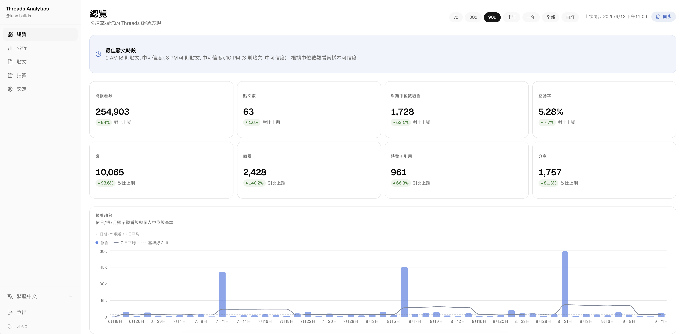

<p align="center">
  
</p>
<h1 align="center">Threads Analytics</h1>
<p align="center">
  自架的 Threads 數據分析儀表板。連接 Access Token，用詳細圖表與指標深入了解你的貼文表現。
</p>
<p align="center">
  <a href="https://github.com/ridemountainpig/threads-analytics/stargazers"></a>
  <a href="./LICENSE"></a>
  <a href="https://github.com/ridemountainpig/threads-analytics/pkgs/container/threads-analytics"></a>
</p>
<p align="center">
  <a href="./README-zh.md">繁體中文</a> · <a href="./README.md">English</a> · <a href="./README-ja.md">日本語</a>
</p>

<p align="center">
  
</p>

---

## 目錄

- [功能](#功能)
- [快速開始](#快速開始)
- [取得 Threads Access Token](#取得-threads-access-token)
- [MCP Server](#mcp-server)
- [部署](#部署)
  - [Docker](#docker)
  - [Vercel](#vercel)
  - [自動同步](#自動同步)
  - [更新既有部署](#更新既有部署)
- [開發設定](#開發設定)
- [分析功能說明](#分析功能說明)
- [授權條款](#授權條款)

---

## 功能

- **總覽** — 數據卡（觀看、讚、回覆、轉發、引用、分享、互動率）含相對上期的漲跌幅、觀看趨勢圖（日／週／月）、最佳發文時段推薦、高曝光貼文
- **分析** — 橫跨**成效**、**內容**與**受眾**三個分頁的 25+ 張圖表
- **貼文** — 可搜尋、可篩選的列表，點選後展開單篇詳細分析
- **MCP server** — 讓 Claude 等 AI agent 透過 OAuth 保護的端點查詢你的分析數據
- 多帳號支援，可隨時切換
- 可設定自動同步間隔
- Access Token 自動續期 — 連接一次即可，不用每 60 天手動重貼
- 密碼保護（單一環境變數 `APP_PASSWORD`）
- 繁體中文 / English / 日本語 介面

---

## 快速開始

最快取得線上實例的方式是一鍵部署 — 兩個模板都會自動建立 PostgreSQL 資料庫並設定好必要的環境變數：

| 平台    | 部署                                                                                                                                                                          |
| ------- | ----------------------------------------------------------------------------------------------------------------------------------------------------------------------------- |
| Railway | [](https://railway.com/deploy/zibjsX?referralCode=vPBCb4&utm_medium=integration&utm_source=template&utm_campaign=generic) |
| Zeabur  | [](https://zeabur.com/templates/XLGQAD)                                                                                     |

也可以交給 AI coding agent（Claude Code、Codex、Cursor…）代勞 — 每個 agent 部署指南都附有現成的 prompt，貼給 agent 就會自動建立資料庫、完成部署並回報網址：[Railway](https://threads-analytics.app/zh-TW/deploy/railway-agent) · [Zeabur](https://threads-analytics.app/zh-TW/deploy/zeabur-agent) · [Vercel](https://threads-analytics.app/zh-TW/deploy/vercel-agent)

已經有自己的伺服器？直接執行預建映像檔（詳見 [Docker](#docker)）：

```bash
docker run -p 3000:3000 --env-file .env.local ghcr.io/ridemountainpig/threads-analytics:latest
```

服務啟動後，用 `APP_PASSWORD` 登入並連接 Threads 帳號 — 見下一節。想從原始碼執行請見[開發設定](#開發設定)。

---

## 取得 Threads Access Token

1. 前往 [developers.facebook.com](https://developers.facebook.com) 建立含有 **Access the Threads API** use case 的應用程式
2. 產生**Access Token**
3. 在儀表板中：**設定 → 新增 Threads 帳號 → 貼上 Token**

詳細圖文步驟請參考：[如何生成 Threads Access Token](./public/token-generate-step/README-zh.md)。

Token 有效期限為 60 天，應用程式會自動幫你續期：

- 每次同步時會檢查 token，當剩餘效期少於 30 天就自動延長 60 天（Threads API 只允許更新產生超過 24 小時的 token）。
- 設定頁面的帳號卡片會顯示 token 的有效期限與上次自動更新時間。
- 若 token 仍然過期（例如應用程式停止太久沒有同步），設定頁面會顯示警示；此時請重新產生 token，並在帳號卡片上點擊**更新 Token**貼上，已同步的資料會完整保留。

---

## MCP Server

Dashboard 內建一個遠端 [MCP](https://modelcontextprotocol.io) server（`/api/mcp`，Streamable HTTP），讓 Claude 等 AI agent 直接查詢你已同步的 Threads 資料——貼文、聚合分析與追蹤者歷史——回答問題或撰寫成效報告。所有工具皆為**唯讀**。

### 連接 AI agent

驗證採用 OAuth 2.1（PKCE + Dynamic Client Registration），不需要複製任何 API key。首次連接時 client 會自行註冊，瀏覽器會開啟 dashboard 登入頁（`APP_PASSWORD`），登入後在同意畫面核准存取即可。

**Claude Code**

```bash
claude mcp add --transport http threads-analytics https://your-deployment.example.com/api/mcp
```

接著在 Claude Code 內執行 `/mcp` 完成 OAuth 登入。

**Claude（網頁版／桌面版）** — 設定 → Connectors → **Add custom connector**，貼上 `https://your-deployment.example.com/api/mcp`。

已連接的 client 會顯示在**設定 → 已連接的 agent**，隨時可以撤銷。

### 工具

| 工具                   | 功能                                                                                                       |
| ---------------------- | ---------------------------------------------------------------------------------------------------------- |
| `get_account_overview` | 帳號名稱、同步狀態、貼文數、資料日期範圍與追蹤者成長摘要——建議的第一個呼叫                                 |
| `list_posts`           | 貼文列表含指標；支援日期範圍、排序（日期／觀看／讚／互動率）、媒體類型篩選、全文搜尋與分頁                 |
| `get_post`             | 單篇貼文完整資訊，含全文                                                                                   |
| `get_analytics`        | 指定日期範圍內的 31 個聚合分析 section（最佳發文時段、關鍵字分析、觀看分佈、發文連續紀錄等），可只取需要的 |
| `get_follower_history` | 每日追蹤者快照與成長摘要，可選擇附上最新受眾組成                                                           |
| `compare_periods`      | 兩個期間的核心指標對照，附絕對與百分比變化；比較期間預設為主要期間正前方的等長視窗                         |

### Prompts

Server 也註冊了現成的 prompts，皆接受選填的 `period` 參數（如 `30d`、`90d` 或日期區間）：

| Prompt                 | 產出內容                                       |
| ---------------------- | ---------------------------------------------- |
| `performance-review`   | 完整成效報告：趨勢、最佳／最差貼文與改善行動   |
| `content-strategy`     | 哪些格式、長度與主題有效，並給出建議的內容組合 |
| `posting-schedule`     | 依受眾互動時間推薦的具體每週發文排程           |
| `viral-post-breakdown` | 深入解析爆紅貼文，萃取可複製的模式             |
| `audience-insights`    | 追蹤者成長與受眾組成，以及對內容和時段的啟示   |
| `topic-analysis`       | 哪些主題與寫作模式帶動成效，並附新貼文點子     |

---

## 部署

### Docker

GitHub Container Registry 上有發佈好的 multi-arch（amd64/arm64）映像檔。設定好[環境變數](#2-設定環境變數)後執行：

```bash
docker run -p 3000:3000 --env-file .env.local ghcr.io/ridemountainpig/threads-analytics:latest
```

也可以自行從原始碼建置：

```bash
docker build -t threads-analytics .
docker run -p 3000:3000 --env-file .env.local threads-analytics
```

Docker 映像檔在啟動時會自動執行 `prisma migrate deploy`。

### Vercel

將 repository 匯入 Vercel 並設定好[環境變數](#2-設定環境變數)。Migration 會透過 `vercel-build` script（`prisma migrate deploy && next build`）在建置階段執行，Vercel 偵測到這個 script 會優先使用它。

Vercel 不支援常駐 process，內建同步 scheduler 無法在上面運行，請改用 [Vercel Cron Jobs](https://vercel.com/docs/cron-jobs) 定期呼叫 `/api/cron/sync`：

1. 在專案根目錄新增 `vercel.json`：

   ```json
   {
     "crons": [
       {
         "path": "/api/cron/sync",
         "schedule": "0 * * * *"
       }
     ]
   }
   ```

   `schedule` 請對應 Settings 中設定的同步間隔（例如每小時 `0 * * * *`、每 30 分鐘 `*/30 * * * *`）。注意 Vercel 免費方案對 cron 頻率有限制。

2. 前往 Vercel Dashboard 的 **Settings → Environment Variables**，新增：

   | 變數          | 值                                         |
   | ------------- | ------------------------------------------ |
   | `CRON_SECRET` | 隨機字串，可用 `openssl rand -hex 32` 產生 |

   Vercel 每次執行 cron 時會自動帶上 `Authorization: Bearer <CRON_SECRET>`，`/api/cron/sync` 會用這個值驗證請求來源是否合法。

### 自動同步

在長時間運行的部署環境（Railway / Zeabur / VPS / Docker）設定 `SYNC_SCHEDULER_ENABLED=true`，內建 scheduler 會隨伺服器啟動，並依照 Settings 中設定的間隔自動同步。Vercel 請改用上方的 cron 設定。

<a id="updating"></a>

### 更新既有部署

新版本會以更新後的 Docker 映像檔發佈。資料庫 migration 會在啟動時自動執行，因此更新只需要取得新的映像檔或程式碼：

- **Docker / VPS** — 拉取最新映像檔，停掉舊 container 後用相同參數重新啟動：

  ```bash
  docker pull ghcr.io/ridemountainpig/threads-analytics:latest
  ```

- **Zeabur** — 開啟 `threads-analytics` 服務並點擊 **Redeploy**，即會拉取最新映像檔。
- **Railway** — 在 Railway Dashboard 對服務觸發重新部署。
- **從原始碼部署** — `git pull` 後執行 `pnpm install && pnpm build`，再以 `pnpm start` 重新啟動（會自動執行 migration）。
- **Vercel** — 推送新版本即可，migration 會如上所述在建置階段執行。

更新過程中資料庫（貼文、洞察資料、帳號）都會完整保留。

---

## 開發設定

系統需求：Node.js 20.9+、pnpm、PostgreSQL 資料庫。

### 1. 複製專案並安裝套件

```bash
git clone https://github.com/ridemountainpig/threads-analytics.git
cd threads-analytics
pnpm install
```

### 2. 設定環境變數

```bash
cp .env.example .env.local
```

接著填入各項數值：

| 變數                     | 說明                                      | 產生方式               |
| ------------------------ | ----------------------------------------- | ---------------------- |
| `APP_PASSWORD`           | 登入儀表板的密碼                          | 自行設定任意字串       |
| `DATABASE_URL`           | PostgreSQL 連線字串                       | 由你的資料庫服務提供   |
| `TOKEN_ENCRYPTION_KEY`   | 加密存放在資料庫中的 Threads Access Token | `openssl rand -hex 32` |
| `CRON_SECRET`            | 正式環境用來保護 `/api/cron/sync`         | 隨機 16 字以上字串     |
| `SYNC_SCHEDULER_ENABLED` | 啟用內建背景同步 scheduler                | Docker/VPS 設為 `true` |

### 3. 執行資料庫 migration

```bash
npx prisma migrate dev
```

### 4. 啟動開發伺服器

```bash
pnpm dev
```

開啟 [http://localhost:3000](http://localhost:3000)，用 `APP_PASSWORD` 登入。

### 5. 連接 Threads 帳號

1. 點擊側邊欄的**設定**
2. 點擊**新增 Threads 帳號**
3. 貼上你的 Threads Access Token（取得方式見[取得 Threads Access Token](#取得-threads-access-token)）
4. 新增完成後會自動開始首次同步（可能需要幾分鐘）

### 常用指令

```bash
pnpm dev          # 啟動開發伺服器
pnpm build        # 建置正式版
pnpm start        # 執行資料庫 migration 並啟動正式伺服器
npx prisma studio # 開啟資料庫 GUI
npx prisma migrate dev --name <名稱>  # 建立新的 migration
```

---

## 分析功能說明

儀表板在總覽、分析（成效／內容／受眾）與貼文頁面共提供 25+ 張圖表。每張圖表的內容說明，以及受眾指標背後的取樣規則，完整記錄在**[分析功能說明](./docs/analytics-zh.md)**。

---

## 授權條款

Threads Analytics 以 [GNU Affero General Public License v3.0](./LICENSE) 開源。你可以自由地自架、修改與再散布 — 但若你以修改後的版本對外提供網路服務，必須以相同授權公開其原始碼。
