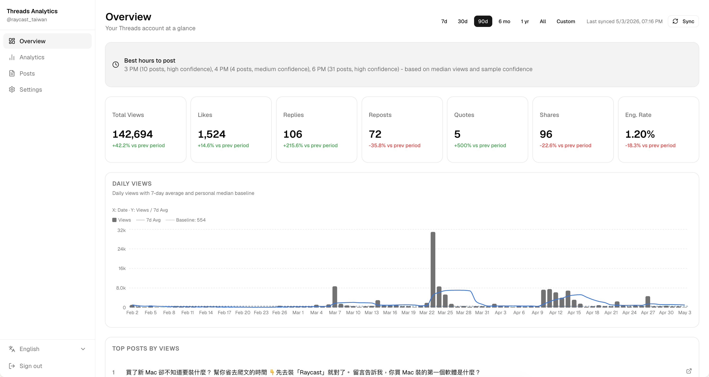

<p align="center">
  
</p>
<h1 align="center">Threads Analytics</h1>
<p align="center">
  A self-hosted Threads analytics dashboard. Connect your access token and explore post performance with detailed charts and metrics.
</p>
<p align="center">
  <a href="./README-zh.md">繁體中文</a> · <a href="./README.md">English</a>
</p>

<p align="center">
  
</p>

---

## Table of Contents

- [Quick Start](#quick-start)
- [Features](#features)
- [Requirements](#requirements)
- [Development](#development)
- [Getting Your Threads Access Token](#getting-your-threads-access-token)
- [Analytics Reference](#analytics-reference)
- [Deployment](#deployment)

---

## Quick Start

```bash
git clone https://github.com/ridemountainpig/threads-analytics.git
cd threads-analytics
pnpm install
cp .env.example .env.local # or create .env.local manually
npx prisma migrate dev --name init
pnpm dev
```

Open [http://localhost:3000](http://localhost:3000) and sign in with `APP_PASSWORD`.

---

## Features

- **Overview** — stat cards (views, likes, replies, reposts, quotes, shares, engagement rate) with period-over-period delta, daily views chart, best posting hour recommendation, viral posts
- **Analytics** — 15+ charts across **Performance** and **Content** tabs
- **Posts** — searchable, filterable list with per-post analytics panel
- Multi-account support with account switching
- Auto-sync on configurable intervals
- Password-protected (single `APP_PASSWORD` env var)
- English / 繁體中文 UI

---

## Requirements

- Node.js 20+
- pnpm
- PostgreSQL database

---

## Development

### 1. Clone and install

```bash
git clone https://github.com/ridemountainpig/threads-analytics.git
cd threads-analytics
pnpm install
```

### 2. Set up environment variables

Create a `.env.local` file in the project root:

```env
APP_PASSWORD=your_dashboard_password
DATABASE_URL=postgresql://...              # PostgreSQL connection string
TOKEN_ENCRYPTION_KEY=                      # openssl rand -hex 32
CRON_SECRET=                               # optional, secures /api/cron/sync in production
```

| Variable               | Description                                   | How to generate        |
| ---------------------- | --------------------------------------------- | ---------------------- |
| `APP_PASSWORD`         | Password to access the dashboard              | Choose any string      |
| `DATABASE_URL`         | PostgreSQL connection string                  | From your DB provider  |
| `TOKEN_ENCRYPTION_KEY` | Encrypts stored Threads access tokens at rest | `openssl rand -hex 32` |
| `CRON_SECRET`          | Secures `/api/cron/sync` in production        | Random 16+ chars       |

### 3. Run database migrations

```bash
npx prisma migrate dev --name init
```

### 4. Start the dev server

```bash
pnpm dev
```

Open [http://localhost:3000](http://localhost:3000) and sign in with your `APP_PASSWORD`.

### 5. Connect a Threads account

1. Go to **Settings** in the sidebar
2. Click **Add Threads account**
3. Paste your long-lived Threads access token (see [Getting Your Access Token](#getting-your-threads-access-token))
4. Click **Sync** to fetch your posts and insights

### Useful commands

```bash
pnpm dev          # Start development server
pnpm build        # Build for production
pnpm start        # Run migrations and start production server
npx prisma studio # Open database GUI
npx prisma migrate dev --name <name>  # Create a new migration
```

## Getting Your Threads Access Token

1. Go to [developers.facebook.com](https://developers.facebook.com) and create an app with the **Threads** product
2. Generate an **Access Token**
3. In the dashboard: **Settings → Add Threads Account → paste token**

> Tokens are valid for 60 days. The dashboard shows an expiry warning when your token is within 30 days of expiring.

---

## Analytics Reference

### Overview

| Section         | What it shows                                                                                                                                                                |
| --------------- | ---------------------------------------------------------------------------------------------------------------------------------------------------------------------------- |
| **Stat Cards**  | Total views, likes, replies, reposts, quotes, shares, and engagement rate for the selected period. Each card shows a `+/−%` delta vs the previous period of the same length. |
| **Best Hours**  | Top 2–3 posting hours ranked by median views, with a confidence indicator based on sample size.                                                                              |
| **Daily Views** | Daily view counts with a 7-day rolling average and your personal median as a baseline.                                                                                       |
| **Top Posts**   | Posts that exceeded the median view count, ranked by their multiplier (e.g. `3.2× median`).                                                                                  |

### Analytics — Performance tab

| Chart                       | What it shows                                                                                                                                           |
| --------------------------- | ------------------------------------------------------------------------------------------------------------------------------------------------------- |
| **Overall Performance**     | Combined daily views, post count, and average views per post on one timeline.                                                                           |
| **Post Quality Map**        | Scatter plot of every post by reach (views) vs. engagement rate. Dot size = shares. Four quadrants: Breakout, Conversation, Broadcast, Underperforming. |
| **Views to Actions Funnel** | Conversion rate from total views into each action type (likes, replies, reposts, quotes, shares).                                                       |
| **Best Time to Post**       | Heatmap of median views by hour of day. Tooltip shows sample count and confidence level.                                                                |
| **Engagement Rate Trend**   | Daily engagement rate (interactions ÷ views) with a 7-day smoothed average.                                                                             |
| **Best Day of Week**        | Median views, engagement rate, and post count by weekday.                                                                                               |
| **Format × Length Matrix**  | 2-D heatmap comparing every combination of content format and post length against your median reach.                                                    |
| **Engagement Breakdown**    | Stacked daily chart of likes, replies, reposts, and quotes over time.                                                                                   |

### Analytics — Content tab

Stat metrics at the top of the tab: **Posting Consistency** (% of weeks with at least one post), **Share Rate**, **Quote Ratio** (quotes ÷ (quotes + reposts)), and **Total Posts**.

| Chart                                   | What it shows                                                                                                                    |
| --------------------------------------- | -------------------------------------------------------------------------------------------------------------------------------- |
| **Posting Activity**                    | Calendar heatmap showing how many posts you published each day.                                                                  |
| **Content Type Performance**            | Median views, engagement rate, and share rate by media type (Text, Image, Video, Carousel, Audio). Low-sample buckets are faded. |
| **Post Length Analysis**                | Median views broken down by character-count bucket. Tooltip includes average, P75, hit rate, and confidence.                     |
| **Publishing Frequency vs Performance** | Whether posting more in a given week raises or lowers per-post average views.                                                    |
| **Shares Trend**                        | Daily share counts over time.                                                                                                    |
| **Top by Engagement Rate**              | Highest-engagement posts ranked by (likes + replies + reposts + quotes) ÷ views.                                                 |
| **Reply-Rate Leaders**                  | Posts ranked by replies ÷ views — your best conversation starters.                                                               |

### Posts page

The posts list supports:

- **Sort** by date, views, or likes
- **Search** full-text across post content
- **Filter** by media type (shows only types present in the current period)

Clicking any post opens a detail panel with views, engagement rate, vs-median multiplier, view percentile, and a per-action engagement breakdown.

---

## Deployment

### Auto-sync behavior

- **Docker, VPS, Railway and other long-running environments** — Uses the built-in scheduler. The app automatically syncs data at the configured interval when the server starts.
- **Vercel** — Does not support long-running processes. Use Vercel Cron to call `/api/cron/sync` instead, and set `CRON_SECRET` to protect this endpoint.

### Docker

Set all environment variables, then run:

```bash
docker build -t threads-analytics .
docker run -p 3000:3000 --env-file .env.local threads-analytics
```

The Docker image runs `prisma migrate deploy` automatically on startup.
