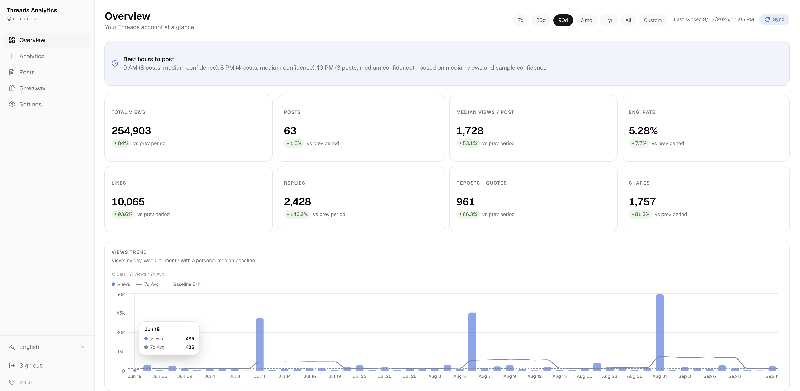
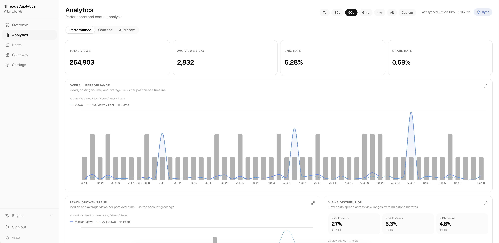
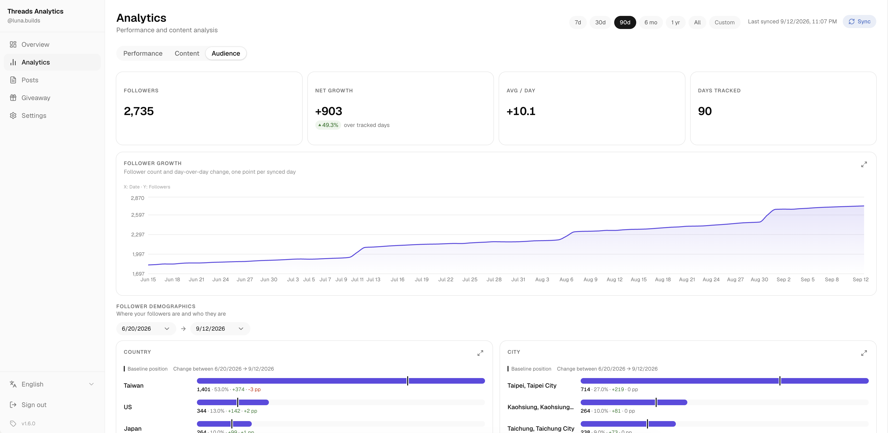
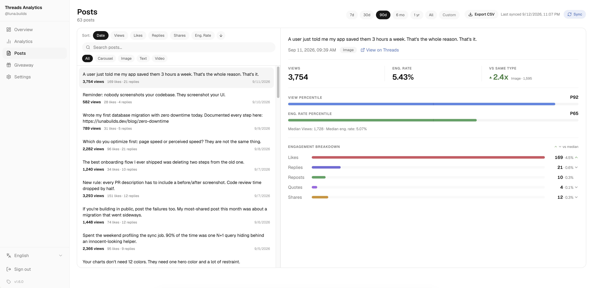
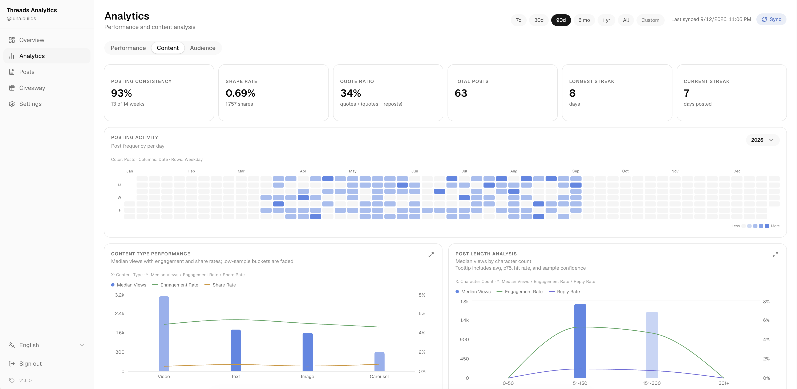

<p align="center">
  
</p>
<h1 align="center">Threads Analytics</h1>
<p align="center">
  A self-hosted Threads analytics dashboard. Connect your access token and explore post performance with detailed charts and metrics.
</p>
<p align="center">
  <a href="https://github.com/ridemountainpig/threads-analytics/stargazers"></a>
  <a href="./LICENSE"></a>
  <a href="https://github.com/ridemountainpig/threads-analytics/pkgs/container/threads-analytics"></a>
</p>
<p align="center">
  <a href="./README-zh.md">繁體中文</a> · <a href="./README.md">English</a> · <a href="./README-ja.md">日本語</a>
</p>
<p align="center">
  <a href="https://threads-analytics.app/en"><strong>Website</strong></a> · <a href="https://threads-analytics.app/en#demo">Live demo</a> · <a href="https://threads-analytics.app/en/token-guide">Token guide</a>
</p>

<p align="center">
  <a href="https://threads-analytics.app/en"></a>
</p>

---

## Table of Contents

- [Features](#features)
- [macOS Desktop App](#macos-desktop-app)
- [Quick Start](#quick-start)
- [Getting Your Threads Access Token](#getting-your-threads-access-token)
- [MCP Server](#mcp-server)
- [Deployment](#deployment)
  - [Docker](#docker)
  - [Vercel](#vercel)
  - [Auto-sync](#auto-sync)
  - [Updating an existing deployment](#updating-an-existing-deployment)
- [Development](#development)
- [Analytics Reference](#analytics-reference)
- [License](#license)

---

## Features

- **Overview** — stat cards (views, likes, replies, reposts, quotes, shares, engagement rate) with period-over-period delta, views trend chart (day / week / month), best posting hour recommendation, viral posts, and how your newest posts are pacing against your typical post
- **Analytics** — 31 charts across **Performance**, **Content**, and **Audience** tabs
- **Posts** — searchable, filterable list with per-post analytics panel, including each post's growth curve over its first week
- **MCP server** — let Claude and other AI agents query your analytics through an OAuth-protected endpoint
- Multi-account support with account switching
- Auto-sync on configurable intervals
- Automatic access-token renewal — connect once, no manual re-pasting every 60 days
- Password-protected (single `APP_PASSWORD` env var)
- English / 繁體中文 / 日本語 UI

<table>
  <tr>
    <td width="50%"></td>
    <td width="50%"></td>
  </tr>
  <tr>
    <td width="50%"></td>
    <td width="50%"></td>
  </tr>
</table>

---

## macOS Desktop App

Macs with Apple silicon (M1 or later) can download the desktop app directly from [GitHub Releases](https://github.com/ridemountainpig/threads-analytics/releases), with no need to install Node.js, pnpm, or PostgreSQL. An Intel Mac build is not currently available.

See the [Mac app guide](https://threads-analytics.app/en/desktop) for download, first launch, update, and uninstall instructions.

To build the desktop app from source, see the [desktop README](./desktop/README.md).

---

## Quick Start

The fastest way to a running instance is a one-click deploy — both templates provision a PostgreSQL database and set the required environment variables for you:

| Platform | Deploy                                                                                                                                                                        |
| -------- | ----------------------------------------------------------------------------------------------------------------------------------------------------------------------------- |
| Railway  | [](https://railway.com/deploy/zibjsX?referralCode=vPBCb4&utm_medium=integration&utm_source=template&utm_campaign=generic) |
| Zeabur   | [](https://zeabur.com/templates/XLGQAD)                                                                                     |

Prefer to let an AI coding agent (Claude Code, Codex, Cursor…) handle it? Each agent deploy guide comes with a ready-made prompt — paste it into your agent and it provisions the database, deploys the app, and hands back the URL: [Railway](https://threads-analytics.app/en/deploy/railway-agent) · [Zeabur](https://threads-analytics.app/en/deploy/zeabur-agent) · [Vercel](https://threads-analytics.app/en/deploy/vercel-agent)

Already have a server? Run the prebuilt image directly (see [Docker](#docker)):

```bash
docker run -p 3000:3000 --env-file .env.local ghcr.io/ridemountainpig/threads-analytics:latest
```

Once the app is up, sign in with your `APP_PASSWORD` and connect a Threads account — see the next section. To run from source instead, see [Development](#development).

---

## Getting Your Threads Access Token

1. Go to [developers.facebook.com](https://developers.facebook.com) and create an app with the **Access the Threads API** use case
2. Generate an **Access Token**
3. In the dashboard: **Settings → Add Threads Account → paste token**

For a screenshot-based walkthrough, see [How to Generate a Threads Access Token](https://threads-analytics.app/en/token-guide).

Tokens are valid for 60 days, and the app renews them for you:

- During each sync, the app checks the token and automatically extends it for another 60 days once fewer than 30 days remain (the Threads API only renews tokens older than 24 hours).
- The account card in Settings shows the token's expiry date and the last automatic renewal.
- If a token still expires — e.g. the app was offline too long for a sync to renew it — the dashboard shows an expiry warning. Generate a new token and paste it with the **Update token** button on the account card; your synced data is kept.

---

## MCP Server

The dashboard ships a remote [MCP](https://modelcontextprotocol.io) server at `/api/mcp` (Streamable HTTP), so AI agents like Claude can query your synced Threads data — posts, aggregated analytics, and follower history — and answer questions or write reports about your account. Everything is **read-only**.

### Connecting an agent

Authentication uses OAuth 2.1 with PKCE and Dynamic Client Registration — there is no API key to copy. On first connection the client registers itself, your browser opens the dashboard login (`APP_PASSWORD`), and you approve access on a consent screen.

**Claude Code**

```bash
claude mcp add --transport http threads-analytics https://your-deployment.example.com/api/mcp
```

Then run `/mcp` inside Claude Code to complete the OAuth sign-in.

**Claude (web / desktop)** — Settings → Connectors → **Add custom connector**, and paste `https://your-deployment.example.com/api/mcp`.

Connected clients appear in **Settings → Connected agents**, where each one can be revoked at any time.

### Tools

| Tool                   | What it does                                                                                                                                                                                                                                                                                          |
| ---------------------- | ----------------------------------------------------------------------------------------------------------------------------------------------------------------------------------------------------------------------------------------------------------------------------------------------------- |
| `get_account_overview` | Every connected account's username, sync status, post count, data date range, and follower growth summary — the recommended first call                                                                                                                                                                |
| `list_posts`           | Posts with metrics; supports date range, sorting (date / views / likes / engagement rate), media-type filter, full-text search, and pagination                                                                                                                                                        |
| `get_post`             | Full detail of a single post, including its complete text and its metrics 1h, 3h, 6h, 12h, 24h, 48h, and 7d after publishing                                                                                                                                                                          |
| `compare_post_growth`  | Posts compared at the same age since publishing (e.g. views 24 hours in) and ranked against your median, plus whether posts too young for that milestone are ahead of or behind your others at the same age                                                                                           |
| `get_analytics`        | 31 aggregated analytics sections over a date range (best time to post, keyword analysis, views distribution, posting streaks, …) — pick only the sections you need                                                                                                                                    |
| `get_follower_history` | Daily follower-count snapshots with growth summary, and optionally the latest audience demographics                                                                                                                                                                                                   |
| `compare_periods`      | Core metrics for two periods with absolute and percentage changes, including account-level views; the comparison period defaults to the same-length window immediately before                                                                                                                         |
| `get_monthly_review`   | One calendar month against a comparison month (the previous one by default, or any earlier month such as the same month last year) and a trailing baseline: KPIs, top and bottom posts, follower gains, content mix, threads, and weekly trend. Pass last month's experiments to have each one scored |

With several accounts connected, every tool except `get_account_overview` takes an `account` argument (username or id). If it is omitted, the tool returns the list of accounts so the agent asks you which one you mean instead of guessing.

Dates given as `YYYY-MM-DD` cover that whole day in the analytics timezone (Asia/Taipei by default; the desktop app uses the Mac's timezone); `list_posts`, `compare_post_growth`, `get_analytics`, `compare_periods`, and `get_monthly_review` also take a `timezone` argument to read them in another zone.

Post growth (the `get_post` milestones and `compare_post_growth`) comes from the metrics each sync records during a post's first 30 days — every 15 minutes at most in the first hours, daily by the end. Recording starts with the version that added it, so posts published earlier have no growth data, and the more often you sync, the finer each post's early curve.

### Prompts

The server also registers ready-made prompts. Most take an optional `period` argument (e.g. `30d`, `90d`, or a date range); `monthly-review` takes a `month` (`YYYY-MM`) and, optionally, the `previous_experiments` from last month's review:

| Prompt                 | What it produces                                                                                                                                                                          |
| ---------------------- | ----------------------------------------------------------------------------------------------------------------------------------------------------------------------------------------- |
| `performance-review`   | A full performance report: trends, best/worst posts, and actions to improve                                                                                                               |
| `content-strategy`     | Which formats, lengths, and topics work, with a recommended content mix                                                                                                                   |
| `posting-schedule`     | A concrete weekly posting schedule based on when your audience engages                                                                                                                    |
| `viral-post-breakdown` | Deep-dive of outlier posts and the repeatable patterns behind them                                                                                                                        |
| `audience-insights`    | Follower growth and demographics, and what they imply for content and timing                                                                                                              |
| `topic-analysis`       | Which topics and writing patterns drive performance, plus new post ideas                                                                                                                  |
| `monthly-review`       | A monthly review that scores last month's experiments and sets three new ones; the experiments stay on your side (e.g. `threads-reviews/YYYY-MM.md`), so nothing is written to the server |

---

## Deployment

The [self-host guide](https://threads-analytics.app/en/deploy/self-host) on the website walks through all of this step by step: Docker, running from source, Vercel cron, environment variables, auto-sync, and updates.

### Docker

A prebuilt multi-arch (amd64/arm64) image is published to GitHub Container Registry. Set the [environment variables](#2-set-up-environment-variables), then run:

```bash
docker run -p 3000:3000 --env-file .env.local ghcr.io/ridemountainpig/threads-analytics:latest
```

Or build the image from source yourself:

```bash
docker build -t threads-analytics .
docker run -p 3000:3000 --env-file .env.local threads-analytics
```

The Docker image runs `prisma migrate deploy` automatically on startup.

### Vercel

Import the repository into Vercel and set the [environment variables](#2-set-up-environment-variables). The `vercel-build` script (`prisma generate && prisma migrate deploy && next build`) generates the Prisma client and runs migrations at build time; Vercel prefers it over `build` when present.

Vercel does not support long-running processes, so the built-in sync scheduler cannot run there. Use [Vercel Cron Jobs](https://vercel.com/docs/cron-jobs) to call `/api/cron/sync` on a schedule instead:

1. Add a `vercel.json` to the project root:

   ```json
   {
     "crons": [
       {
         "path": "/api/cron/sync",
         "schedule": "0 * * * *"
       }
     ]
   }
   ```

   Adjust `schedule` to match the sync interval you set in Settings (e.g. `0 * * * *` for every hour, `*/30 * * * *` for every 30 minutes). Note that Vercel's free plan limits cron frequency.

2. In the Vercel dashboard go to **Settings → Environment Variables** and add:

   | Variable      | Value                                                  |
   | ------------- | ------------------------------------------------------ |
   | `CRON_SECRET` | A random secret — generate with `openssl rand -hex 32` |

   Vercel automatically injects this value as `Authorization: Bearer <CRON_SECRET>` on every cron request, and the `/api/cron/sync` route uses it to verify the call is legitimate.

### Auto-sync

On long-running deployments (Railway / Zeabur / VPS / Docker), set `SYNC_SCHEDULER_ENABLED=true`. The built-in scheduler starts with the server and syncs every connected account — not only the active one — at the interval configured in Settings. On Vercel, use the cron setup above instead.

<a id="updating"></a>

### Updating an existing deployment

New versions ship as updated Docker images. Database migrations run automatically on startup, so updating only requires getting the new image or code:

- **Docker / VPS** — pull the latest image, then stop the old container and start a new one with the same flags:

  ```bash
  docker pull ghcr.io/ridemountainpig/threads-analytics:latest
  ```

- **Zeabur** — open the `threads-analytics` service and click **Redeploy** to pull the latest image.
- **Railway** — trigger a redeploy of the service from the Railway dashboard.
- **From source** — `git pull`, then `pnpm install && pnpm prisma:generate && pnpm build` and restart with `pnpm start` (runs migrations automatically).
- **Vercel** — push the new version; migrations run at build time as described above.

Your database (posts, insights, accounts) is preserved across updates.

---

## Development

Requirements: Node.js 22.12+ or 24+, pnpm, and a PostgreSQL database.

### 1. Clone and install

```bash
git clone https://github.com/ridemountainpig/threads-analytics.git
cd threads-analytics
pnpm install
```

### 2. Set up environment variables

```bash
cp .env.example .env.local
```

Then fill in the values:

| Variable                 | Description                                   | How to generate        |
| ------------------------ | --------------------------------------------- | ---------------------- |
| `APP_PASSWORD`           | Password to access the dashboard              | Choose any string      |
| `DATABASE_URL`           | PostgreSQL connection string                  | From your DB provider  |
| `TOKEN_ENCRYPTION_KEY`   | Encrypts stored Threads access tokens at rest | `openssl rand -hex 32` |
| `CRON_SECRET`            | Secures `/api/cron/sync` in production        | Random 16+ chars       |
| `SYNC_SCHEDULER_ENABLED` | Enables the built-in polling scheduler        | `true` for Docker/VPS  |

### 3. Run database migrations

```bash
npx prisma migrate dev
```

### 4. Start the dev server

```bash
pnpm dev
```

Open [http://localhost:3000](http://localhost:3000) and sign in with your `APP_PASSWORD`.

### 5. Connect a Threads account

1. Go to **Settings** in the sidebar
2. Click **Add Threads account**
3. Paste your long-lived Threads access token (see [Getting Your Access Token](#getting-your-threads-access-token))
4. The first sync starts automatically and may take a few minutes

### Useful commands

```bash
pnpm dev          # Start development server
pnpm build        # Build for production
pnpm start        # Run migrations and start production server
npx prisma studio # Open database GUI
npx prisma migrate dev --name <name>  # Create a new migration
```

---

## Analytics Reference

The dashboard ships 31 charts across the Overview, Analytics (Performance / Content / Audience), and Posts pages. Browse them with demo data on the [website](https://threads-analytics.app/en/analytics); what every chart shows — and the sampling rules behind the audience metrics — is documented in the **[Analytics Reference](./docs/analytics.md)**.

---

## License

Threads Analytics is open source under the [GNU Affero General Public License v3.0](./LICENSE). You are free to self-host, modify, and redistribute it — but if you run a modified version as a network service, you must make its source code available under the same license.
