# How to Generate a Threads Access Token

[繁體中文](./README-zh.md) | English | [日本語](./README-ja.md)

This guide follows `step-1.png` through `step-18.png` and explains how to create a Meta Developers app, add the Threads API use case, invite a Threads Tester, and generate a Threads Access Token for Threads Analytics.

Before you start, prepare:

- A Facebook / Meta account that can sign in to [Meta for Developers](https://developers.facebook.com/apps/)
- A public Threads account
- Access to the Threads account that will accept the tester invitation

> This flow is intended for personal or testing use. To support non-test users, you usually need to complete App Review and publish the app.

## Step 1: Open Meta Developers and create an app

Open [https://developers.facebook.com/apps/](https://developers.facebook.com/apps/) and click **Create App** in the top-right corner of the **Apps** page.

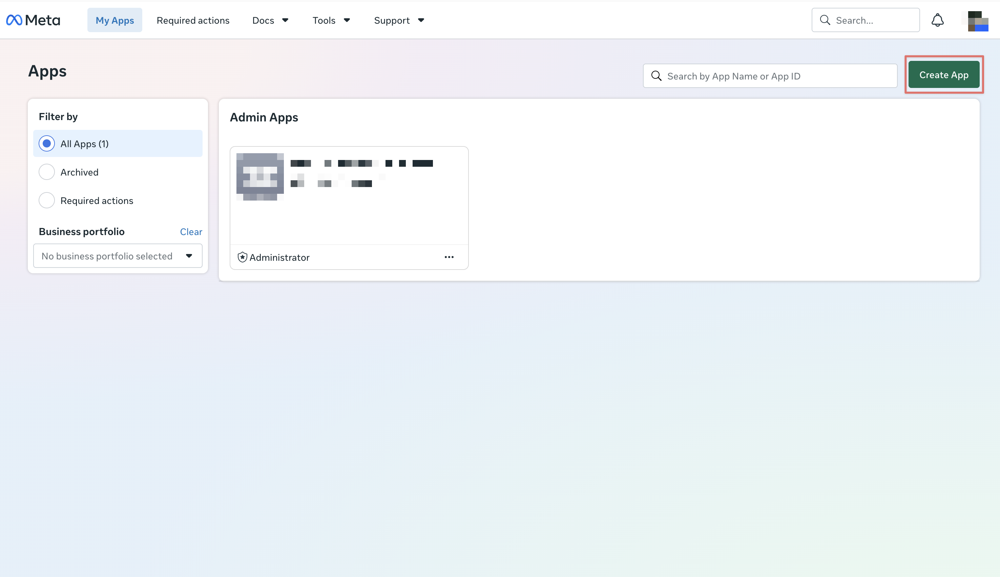

## Step 2: Enter app details

On the **Create an app** page, enter:

- **App name**: for example, `Threads Analytics`
- **App contact email**: your contact email

Then click **Next**.

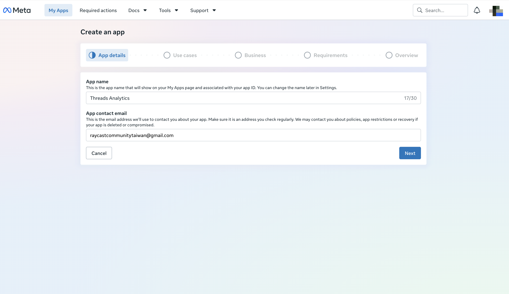

## Step 3: Select the Threads API use case

On the **Add use cases** page, find **Access the Threads API**, select the checkbox on the right, and click **Next**.

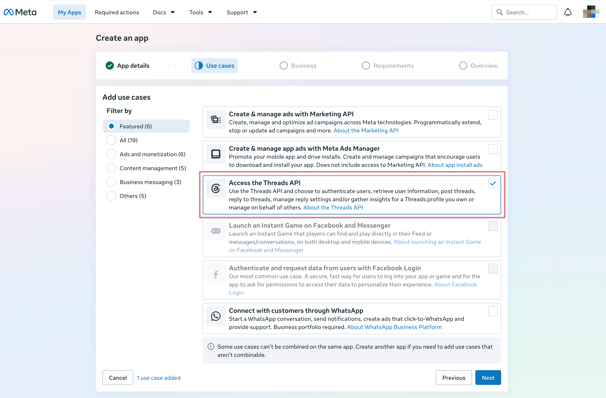

## Step 4: Skip business portfolio connection

On the business portfolio step, select **I don't want to connect a business portfolio yet.**, then click **Next**.

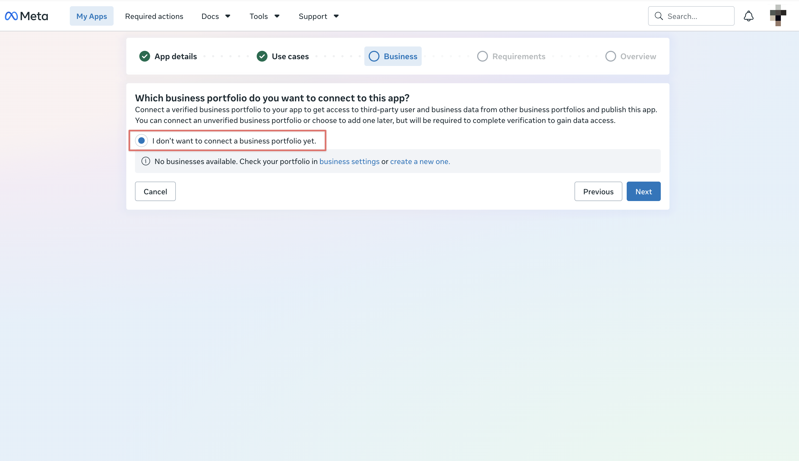

## Step 5: Confirm publishing requirements

When the page shows **No requirements identified**, there are no additional requirements for this setup. Click **Next**.

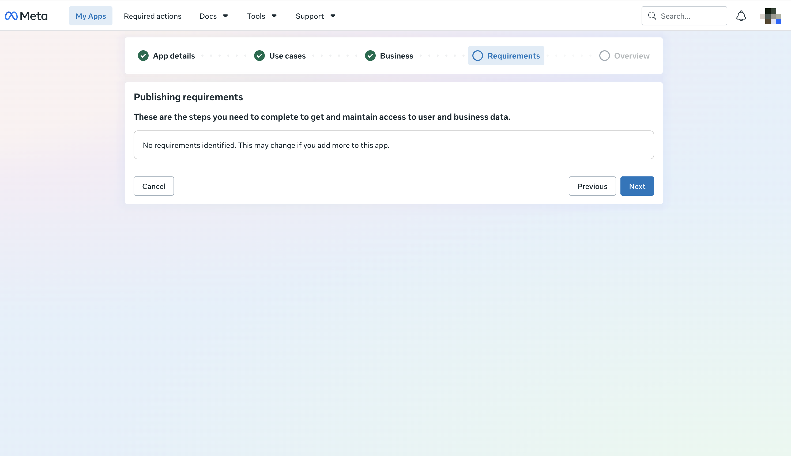

## Step 6: Create the app

On the **Overview** page, confirm the app name, email, use case, business, and requirements. Click **Create app** in the bottom-right corner.

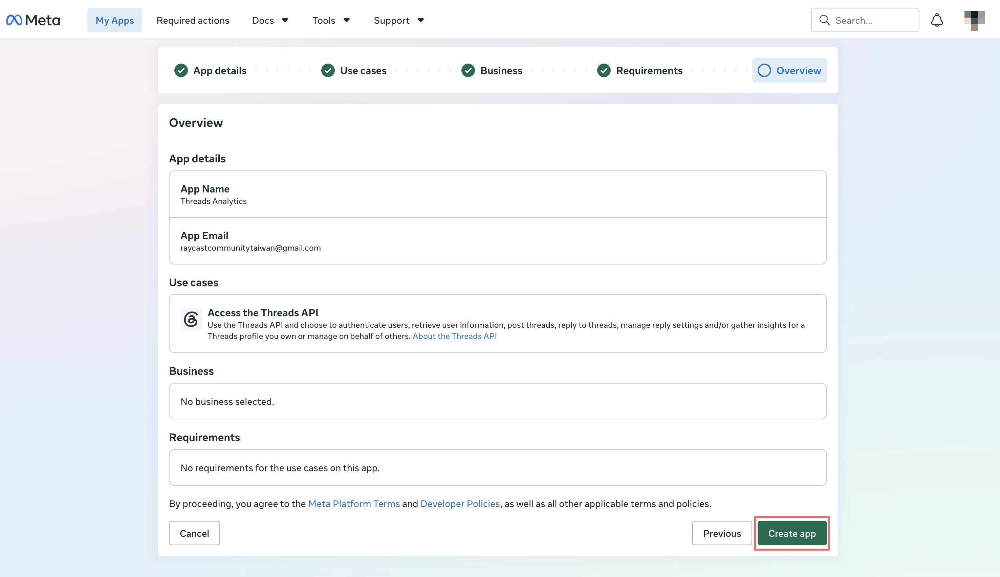

## Step 7: Open Use cases

After the app is created, you will land on the Dashboard. Click **Use cases** in the left sidebar.

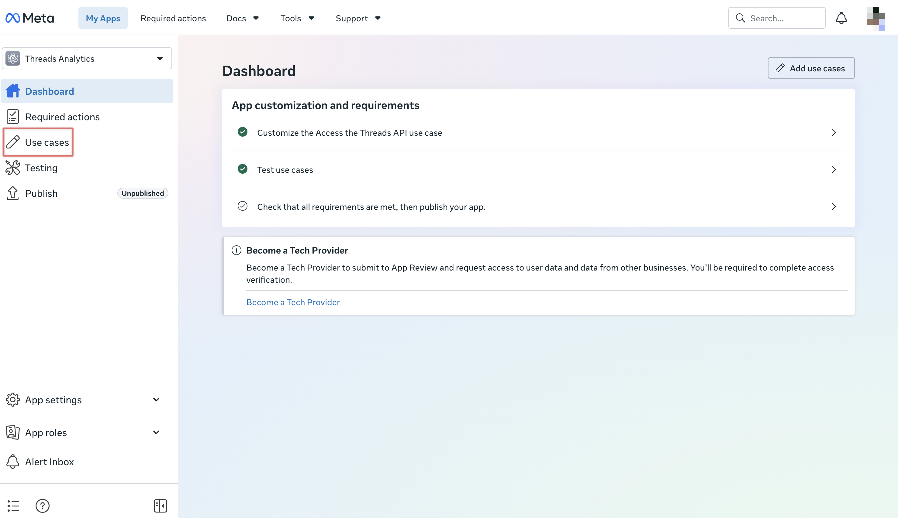

## Step 8: Customize the Threads API use case

On the **Use cases** page, find **Access the Threads API** and click **Customize**.

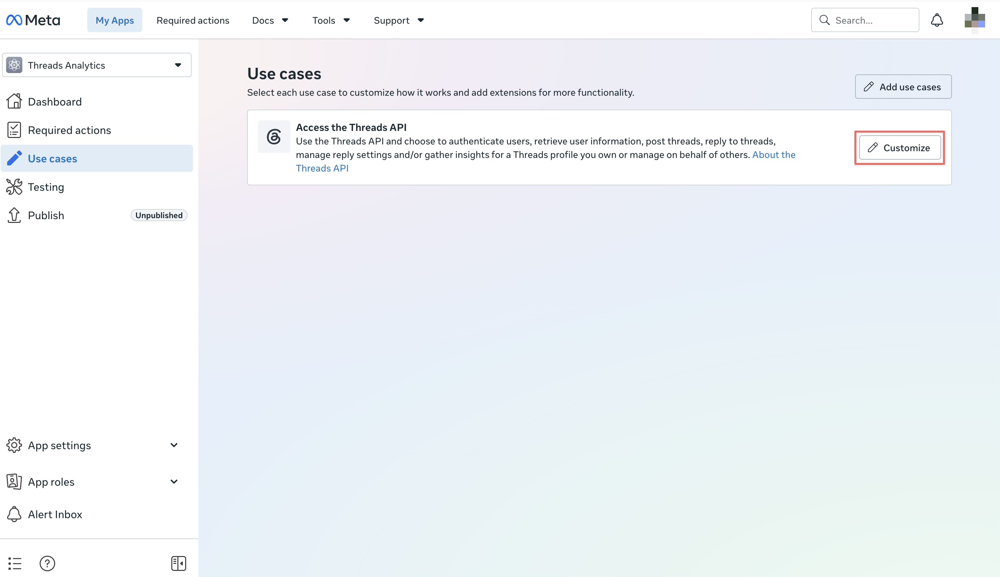

## Step 9: Open Settings

In **Customize use case**, the left panel shows **Permissions and features** and **Settings**. Click **Settings**.

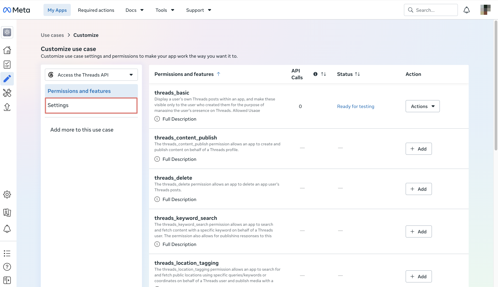

## Step 10: Open Threads Tester management

At the bottom of the **Settings** page, find **User Token Generator** and click **Add or Remove Threads Testers**.

This page also shows:

- **Threads app ID**
- **Threads app secret**
- **Threads Display Name**
- **User Token Generator**

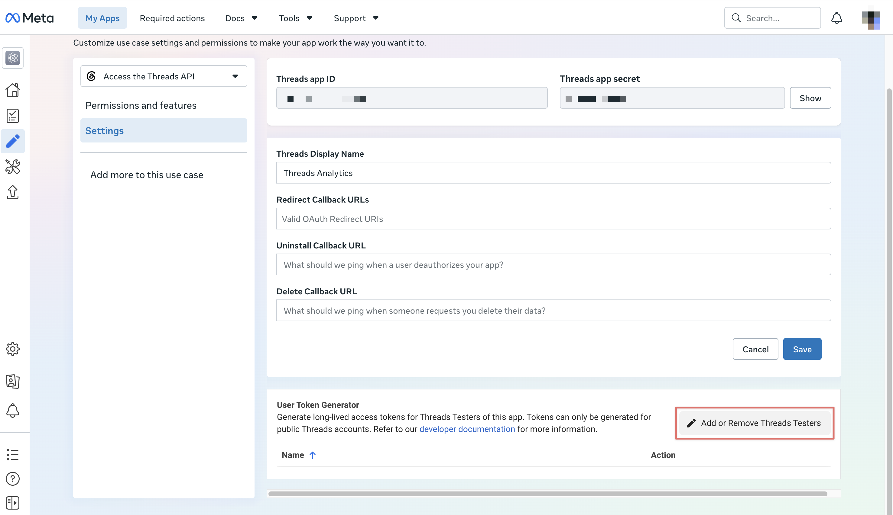

## Step 11: Add people

You will be taken to the **App roles** page. Click **Add People** in the top-right corner.

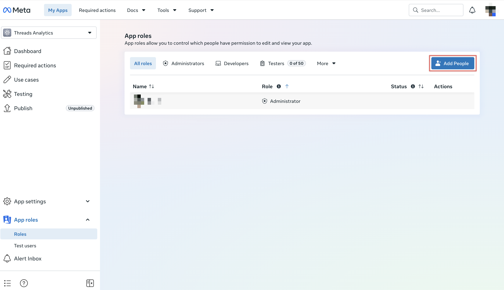

## Step 12: Assign the Threads Tester role

In the **Add people to your app** dialog:

1. Select **Threads Tester**
2. Search for and select the Threads account that should generate the token
3. Click **Add**

> The invited account must be a public Threads account and must accept the invitation from Threads. If the account does not appear in search, confirm that the user has a Meta/Facebook Developer account and that their Threads profile is public.

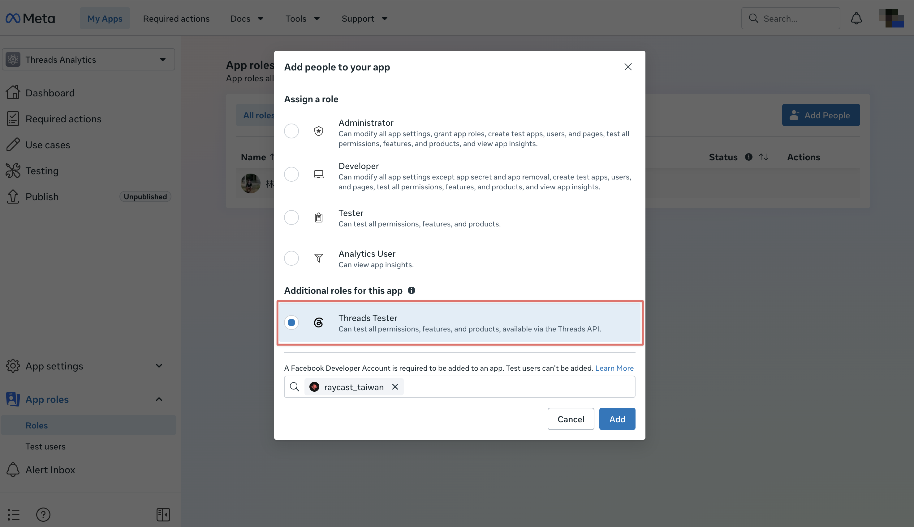

## Step 13: Open website permissions in Threads

Using the invited Threads account, open Threads on the web. Go to **More settings**, then click **Website permissions**.

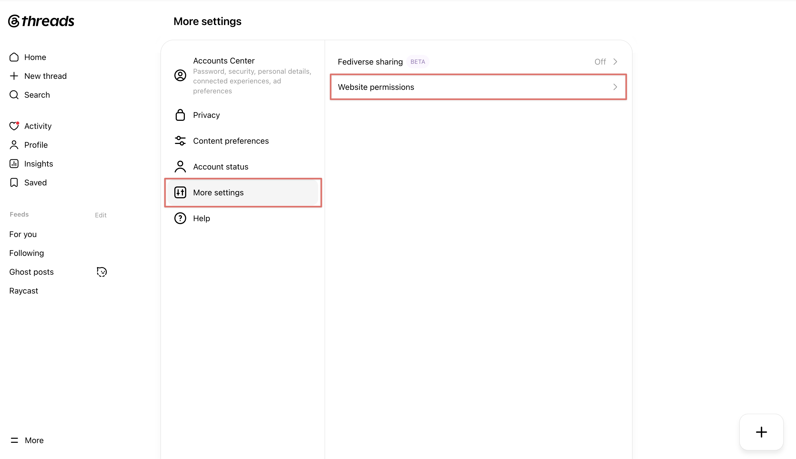

## Step 14: Accept the tester invitation

In **Website permissions**, open the **Invites** tab. Find the app you created, such as **Threads Analytics**, and click **Accept**.

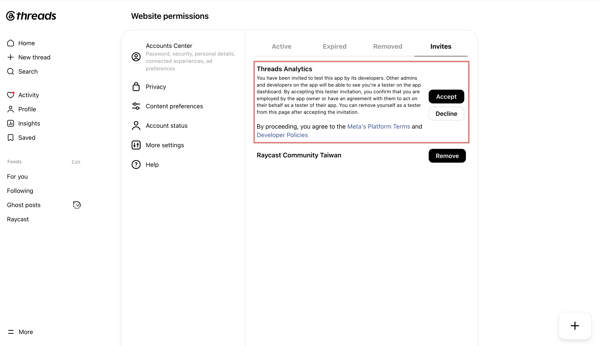

## Step 15: Return to Threads API Settings

After accepting the invitation, return to the app in Meta Developers. Go to **Use cases** → **Access the Threads API** → **Customize**, then click **Settings** in the left panel.

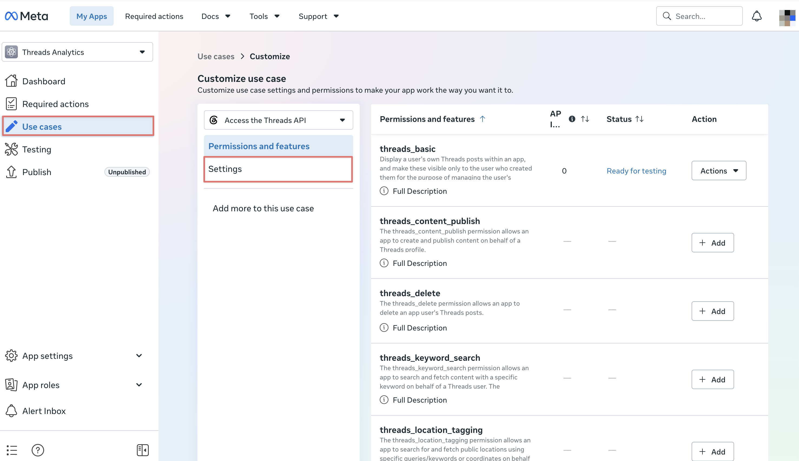

## Step 16: Generate the access token

In **User Token Generator**, find the Threads Tester that accepted the invitation and click **Generate Access Token** on the right.

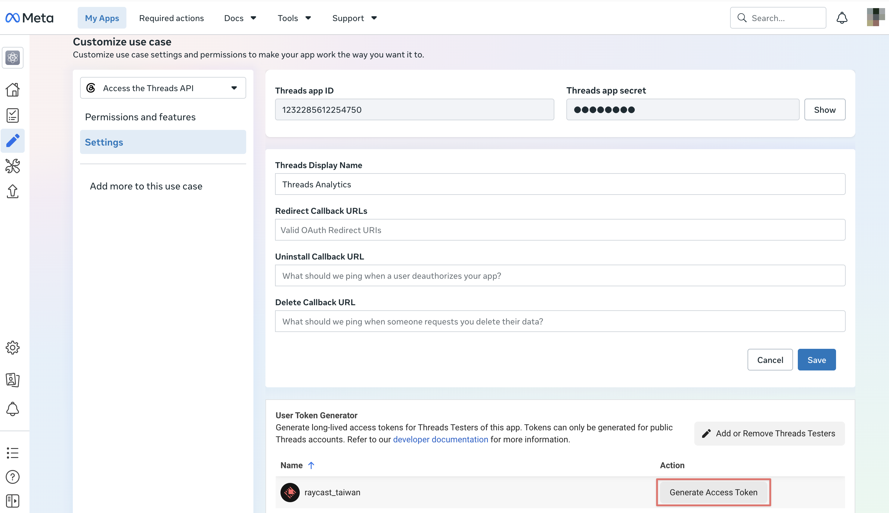

## Step 17: Confirm authorization

The authorization page lists the Threads permissions the app will receive. Confirm the account is correct, then click **Continue As ...**. If you click **Edit access**, do not disable the data or insights permissions needed by Threads Analytics, otherwise the token may not be able to sync analytics data.

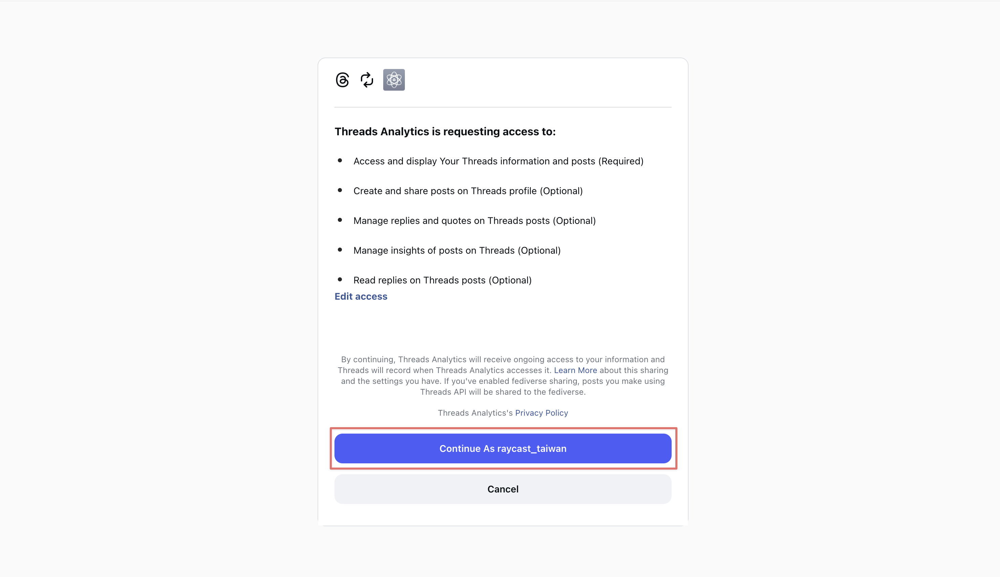

## Step 18: Copy the access token

After returning to Meta Developers, the token dialog appears. Select **I understand**, then click **Copy** to copy the generated long-lived Threads Access Token.

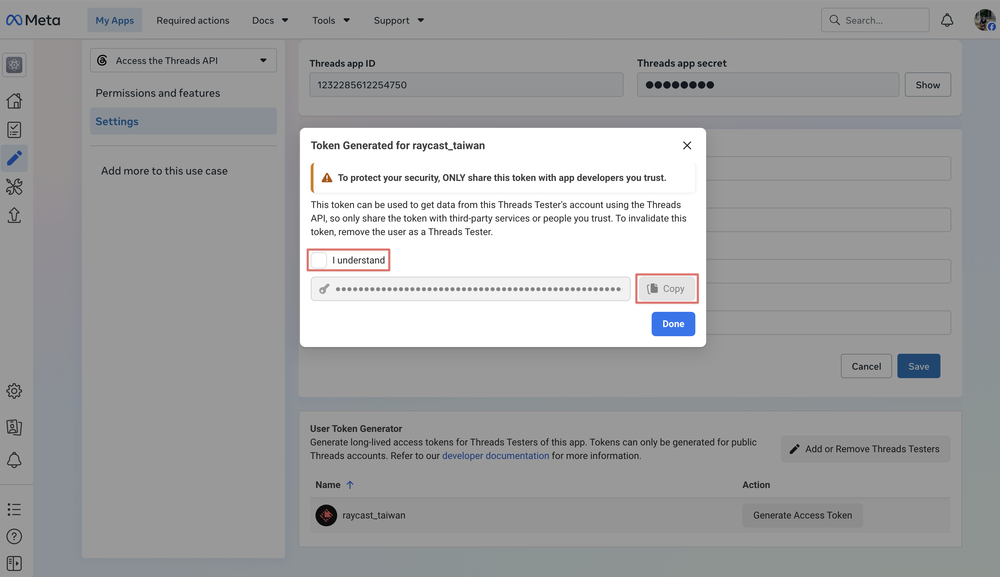

Paste the token into Threads Analytics under **Settings** → **Add Threads account** to start syncing data.

> Threads Access Tokens expire. If syncing fails or the token is close to expiry, generate a new token with the same flow.
